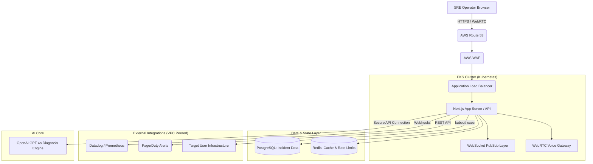

# DeployPilotOS Technical Architecture

This document outlines the production-grade deployment architecture for the DeployPilotOS SRE Agent, structured for a highly available, cloud-native deployment (e.g., AWS/EKS).

## Architecture Diagram

You can paste this mermaid block into any markdown viewer (like GitHub or Notion) to automatically render the technical infrastructure diagram.

---

## 1. Edge & Traffic Management (AWS Route 53 & WAF)
All incoming traffic from the SRE operator's dashboard is routed through AWS Route 53. An AWS Web Application Firewall (WAF) mitigates DDoS attacks and screens for malicious payloads before they hit the application layer.

## 2. Application Layer (Next.js on Kubernetes)
The core React/Next.js application runs as a stateless container inside an Amazon EKS (Elastic Kubernetes Service) cluster. 
- **SSR & API Routes:** Handles standard dashboard rendering, configuration management, and REST API requests.
- **WebSocket PubSub:** Pushes zero-latency incident updates from the server directly to the operator's browser UI.
- **WebRTC Voice Gateway:** Manages the real-time "Voice War Room" connections, capturing streaming audio and forwarding it to transcription services.

## 3. Data & State Layer
- **PostgreSQL:** Acts as the primary operational database, strictly storing incident history, user-configured runbooks (YAML), and immutable audit logs of agent actions.
- **Redis:** Manages real-time pub/sub for instant dashboard UI updates across multiple connected clients, while also handling strict API rate limiting for the OpenAI endpoints.

## 4. The Diagnosis Engine (OpenAI Integration)
When the Next.js API receives a webhook alert (e.g., from Datadog), it aggregates the logs and securely transmits them to OpenAI's GPT-4o models using strict structured JSON outputs. This layer acts as the autonomous "brain", parsing raw telemetry and outputting a deterministic `rootCause` and `confidenceScore`.

## 5. Execution Layer (The Autonomous Agent)
Once a runbook is triggered by the AI Diagnosis Engine, the Next.js backend assumes a scoped IAM role capable of interacting directly with the target infrastructure (e.g., executing `kubectl scale` commands or modifying AWS Security Groups) to remediate the outage autonomously without human intervention.
